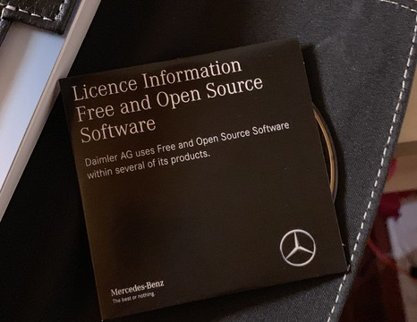

layout: true

.header[
.font-xs.bold.nord8.letter-spacing-60[Free & Open-source software licenses]
]

.footnote[
.font-sm.bold.nord8[sebastien.campion@pm.me
.ri-creative-commons-line.icon-inline.nord8[]
.ri-creative-commons-by-line.icon-inline.nord8[]
.ri-creative-commons-nc-line.icon-inline.nord8[]
.ri-creative-commons-sa-line.icon-inline.nord8[]
]]

---
class: nord-dark, center, middle

background-image: url(img/riccardo-annandale-7e2pe9wjL9M-unsplash3.jpg)

 
 
 

# [IP and Software Code Management  ](https://github.com/scampion/IP-and-Software-Code-Management/archive/main.zip)
 

####  

 

 
 
 
 

.float-right.width-0.pt-xxs.pl-xs[]

???
.letter-spacing-100[DRAFT VERSION]

---
#What 📊 
Free and Open Source Compliance 
.block-middle.width-90[]
.right.font-sm.nord9[Source: Quo Vadis, Open Source? The Limits of Open Source Growth]
---
---
#What 📈
Free and Open Source Compliance 
.block-middle.width-90[]
.right.font-sm.nord9[Source: Quo Vadis, Open Source? The Limits of Open Source Growth]
---
---
#What 
Free and Open Source Compliance 
.block-middle.width-90[]
.right.font-sm.nord9[Source: [Open Source Licensing: Types, Strategies and Compliance - Jeff Luszcz](https://www.youtube.com/watch?v=GGabCyCbTVU)]
---
---
#What 
Free and Open Source Compliance 
.block-middle.width-90[]
.right.font-sm.nord9[Source: Quo Vadis, Open Source? The Limits of Open Source Growth]
---

# 📝 Definition 
---------------

> A software license is a legal instrument [...] governing the use or redistribution of software.

.right.font-sm.nord9[Wikipedia]

 
It's tool to manage the software usage. 

> Licenses are tools and different tools serve different purposes.  

 
As a user, this legalese that makes it all work can be kind of confusing
and boring and even intimidating, and sometimes you might think it's pointless

???
It only helps you see why things are the way they are,
but actually gives you new tools, new ways to influence and control
how your software is used, and to help you make sure
it achieves the goals that you set for it.

---

# 👥 Actors
-----------

 

### Several roles and point of views when we are talking about licenses
 
#### **Producer** : You create a software and define the license associated
 
#### **Consumer** : You integrate several FOSS components in your developments
 
#### **Contributor** : You send back your contributions to the maintainers
 

---
# 🚀 Goals 
-----------
 
- ### •  Learning the basics of how intellectual property law works
 
- ### •  Understanding how licenses are built on top of those principles
 
- ### •  Working effectively with free and open source software in the different roles
---
background-image: url(img/jeshoots-com-9n1USijYJZ4-unsplash2.jpg)

# Overview:
-----

- ### • The intellectual property landscape

--
- ### • Why we do need license ?

--
- ### • Permissive licenses

--
- ### • Copyleft licenses

--
- ### • Public domain

--
- ### • Customs licenses

--
- ### • Trends in the license usage

--
- ### • Non-Software Licenses

--
- ### • Source code scanner and tooling

--
- ### • Licensing contributions

---

class: nord-dark

background-image: url(img/melinda-gimpel-xcVW_sFp4jQ-unsplash.jpg)

## Disclaimer
-----
###I'M NOT A 

---
background-image: url(img/Bliss.png)
class: center, middle
class: center, middle

# **IP Landscape**
 
 
 
 

.font-sm.nord4[
Microsoft product screenshot
 
This image is a copyrighted screenshot of a commercially released computer software product of Microsoft Corporation.
Microsoft Corporation has allowed screenshots of its commercially released computer software products to be used in 
advertising, documentations, educational materials, videos and web sites as long as they are not obscene or 
pornographic, are not disparaging, defamatory, or libelous to Microsoft, and are not digitally altered (except 
for being resized).
]

---

# What is Intellectual Property ?
-------
> Intangible "creation of the mind" that lets you monopolize.

--

The categories we will be looking at today : 

--

 
-  #### ◦ Copyrights 

--

 
- #### ◦ Patents

--

 
- #### ◦ Trademarks

---

# Copyright ©
--------------

- ### ◦ Protects creative, expressive works
 
- ### ◦ Meant to encourage people making more
 
- ### ◦ Given /automatically/ to the creator - [Berne Convention 1986](https://wipolex.wipo.int/en/text/283698#P109_16834)
 
- ### ◦ Limited-time offer!
 
.center[###It protects two types of rights :]
.center[###*Economic* rights and *Moral* rights]

---

# 🔏 Moral Rights
--------------

- ### ◦ Non-commercial right related to the copyright 
- ### ◦ Right to attribution, integrity of the work
- ### ◦ Vary a lot from country to country
- ### ◦ Might not be automatic
- ### ◦ Might last forever
- ### ◦ Might not be possible to waive or transfer

???
> And moral rights are sort of the non-commercial part of copyright.
It's not so much about making money off of your creation.
It's about things like the right to be identified as the author,
or the right to the integrity of the work.
And "integrity" in this context means keeping people from changing
or presenting your work in ways that you don't like,
like putting on a display and defacing your art,
even if they own it.

> And in some countries, you cannot waive, reject,
or give away or sell your moral rights.
It's just not allowed,

---

# 💡 Patents
-------------

- ####◦ For protecting functional inventions
- ####◦ The deal: tell us how it works, and you get *exclusivity* ... for a while 
- ####◦ Beware of sneaky troll and ambushes !
- ####◦ Some licenses protect you 
 
 
 
.center[### FFMPEG and multimedia codecs patents  http://ffmpeg.org/legal.html]

---

# ® Trademarks ™
--------------

- ####◦  For protections from fakes and imitators
 
- ####◦  Sort of automatic, but registration® has power
 
- ####◦  Covers names, logos and identifiers
 
- ####◦  Still relevant to software projects 
 

Debian and Mozilla - a study in trademarks - https://lwn.net/Articles/118268/
.block-middle.width-30[]

---
class: center, middle
# 📜 Licenses 
---
# Licenses 
-------------
- Intellectual property law is a reality whether you like it or not
> A license is a set of permissions that you give to someone.
 
- #### Grant rights people wouldn't usually have:
- #####◦ To use
- #####◦ To modify 
- #####◦ To share 

 
- #### Create obligations:
- #####◦ Attribution 
- #####◦ Share-alike (copy left)
- #####◦ Whatever shows up in a proprietary license

???

When you create something like a piece of software, you alone have the right to it, and you have control
over how to share those rights with others.
A license is what we use to give people rights they wouldn't ordinarily have, as the right to use the software,
to modify it, or to copy and share it.

The most obvious example is of course proprietary software,
which generally has a license that only gives you the right to use it,
but prohibits you not just from copying and sharing it,
but also from things like reverse engineering it,
or in some cases even from really wild stuff
like benchmarking the performance of the software
and sharing that data.
Some proprietary database licenses have that.

the key idea is that without a license,
no one has any rights to the software, and the license is the thing

 just publishing the source code,
like by throwing it up on GitHub without a license,
that does not give anyone any rights.
That is not code you can use, it's just code

---

## 🙀 419 Licenses listed by the Linux™ Foundation
---------------------------------------------------

This inventory was made during the specification of the *Software Package Data Exchange* standard.

<iframe width="100%" height="70%" src="https://spdx.org/licenses/" allowfullscreen frameborder=”no” border=”0″ marginwidth=”0″ marginheight=”0″ scrolling=”no” allowtransparency=”yes”></iframe>

---

## 🗄 Main categories
----------------------

.block-middle.width-70[]

---
background-image: url(img/Software_Categories_expanded.svg2.png)
---

# Permissive Licenses
--------------

- #####◦  Let developers do a lot ... including making things proprietary
- #####◦  Usually just require attribution ... and a warranty disclaimer 
 
##### .center[***MIT/Expat/X11, ISC/n-clause BSD ... Apache 2.0***]
 

As a *producer*, choose a permissive license when your goal is only for the code to be shared and used as widely as possible.
You would then make life as easy as possible for developers by making everything available to them for whatever use they want,
even if they don't want to reciprocate by sharing their improvements back to you.
That's a very pragmatic approach. It's very business-friendly.

As a *consumer*, permissive licenses are the most easy to use.
About the original BSD license, before 1999, it contains a controversy "advertising clause", don't forget it. 

 
A use case in 2006 : **Mac OS X Kernel Source Now Closed** https://slashdot.org/story/06/05/17/1453206/mac-os-x-kernel-source-now-closed  

???
> You can do pretty much whatever with the software.
You can even build proprietary code on top of the the code that's been shared.
You usually just have to provide attribution, meaning you have to give credit to the person who wrote it, and there's often
???
---
# 🔓 Apache 2.0 
-----------------
 
- ####◦ anti-patent-ambush clause.  
- ####◦ key patent-troll-killing. 
 

>    ... each Contributor grants [...] You a perpetual, worldwide, non-exclusive, no-charge, royalty-free, 
>    irrevocable [...] patent license to make, have made, use, [...] the Work ...

 

>    ... applies only to those patent claims [...] that are necessarily infringed by their Contribution(s) 

 

>    ... If You institute patent litigation [...] alleging that the Work [...] constitutes 
>    direct or contributory patent infringement, then any patent licenses granted to 
>    You [...] shall terminate 

???

little more verbose than the ones we just looked at --
instead of like three paragraphs, it's more like three pages --
and it has some kind of slightly annoying requirements
about putting notices in files you've changed,
but it also has a really important clause that the other ones don't,
and that is a grant of patent license,
which, going back to what we talked about earlier about patents,
this is the kind of clause that I've said is really great to have

---

#  &copy;  Copyleft  
----------------------------------------------------

- ### ◦ Guarantees user freedom

>Freedom 0 : the freedom to use the work

>Freedom 1 : the freedom to study the work

>Freedom 2 : the freedom to copy and share the work with others

>Freedom 3 : the freedom to modify the work, and the freedom to distribute modified and therefore derivative works

- ### ◦ Prevents developers from restricting or locking-in users 
- ### ◦ Requires sharing derivatives the same way
- ### ◦ Prevents building proprietary software
 
### .center[***GPL, LGPL, AGPL***]

---
background-image: url(img/february11_daffara2.png) 
### Compliance 
-----------
Adapted from David A. Wheeler ([2007](http://www.dwheeler.com/essays/floss-license-slide.html))

---
# ✖ Multi licenses and distribution
--------------------------------------

.float-right.width-47.pt-xxs.pl-xs[]
Reminder: as the owner of the software, you can choose to distribute it under several licenses. 

> MySQL is free and open-source software under the 
> terms of the GNU General Public License,
> and is also available under a variety of proprietary licenses.

 
⚠️ You should manage the contributions to keep the full copyright.

----- 

If you do not redistribute the software, some clauses are not relevant. 

⚠️ Network license like AGPL and API 

---
# 🌍 Public domain 
------------------
.float-right.width-40.pt-xxs.pl-xs[]
.float-left.width-13.pt-xxs.pr-xs[]

- ##### ◦ I don't care; do whatever! (a.k.a "What about the the Public Domain ?")
 
- ##### ◦ As *producer*, please do pick a license
 
- ##### ◦ Visible source ≠ Free/Open source
 
- ##### ◦ Public domain ... remember "morals rights" ?

---

background-image: url(img/chris-slupski-eVSwGV-PS2Y-unsplash2.jpg)

# Custom license 
--------------

      
### .center[PLEASE DON'T]

---
class: nord-dark, center, middle
background-image: url(img/isaac-smith-AT77Q0Njnt0-unsplash2.jpg)

# ***Trends***

---
### 📊 Top in 2019
---------------------------

.block-middle.width-90[]

.right.font-sm.nord9[Source: whitesourcesoftware]

---
### 📈 Trend in 2019
---------------------------

.block-middle.width-90[]

.right.font-sm.nord9[Source: whitesourcesoftware]

---
### 📈 Apache 2 popularity
---------------------------

.block-middle.width-90[]

.right.font-sm.nord9[Source: whitesourcesoftware]

---
background-image: url(img/umberto-lhJrm1BRVV0-unsplash2.jpg)

# 📄 Non-Software Licenses
------------------------
.float-right.width-45.pt-xxs.pl-xs[]

- ##### ◦ Remember, the point of the license is to further your goals - and not-code is different from code!

 
- ##### ◦  GNU Free Documentation License (GFDL)
- ##### ◦ .ri-creative-commons-line.icon-inline[] Creative Commons (BY, NC, ND, SA)
## .ri-creative-commons-by-line.icon-inline[] Attribution
## .ri-creative-commons-nc-line.icon-inline[] Non Commercial
## .ri-creative-commons-nd-line.icon-inline[] No derivative works
## .ri-creative-commons-sa-line.icon-inline[] Share alike

---

# 🤝 Licensing contributions
-----------------------------

- #### ◦ [Copyright Transfer Agreement (CTA)](https://en.wikipedia.org/wiki/Copyright_transfer_agreement)
 
- #### ◦ [Contributor License agreement (CLA)](https://en.wikipedia.org/wiki/Contributor_License_Agreement)
 
- #### ◦ [Developer's Certificate of Origin (DCO)](https://en.wikipedia.org/wiki/Developer_Certificate_of_Origin)
 
 

.center[Project Harmony by Canonical]
.center[http://harmonyagreements.org/]

---

### 🔬 Software Heritage Confidential Scanner
----------------------------------------------
https://scan.certcode.eu
<iframe width="100%" height="70%" src="https://scan.certcode.eu" allowfullscreen frameborder=”no” border=”0″ marginwidth=”0″ marginheight=”0″ scrolling=”no” allowtransparency=”yes”></iframe>

---

# Conclusions
-------------

##### As producer, pick a license :
- ##### ◦ ... that is already established and widely use
- ##### ◦ ... that makes sense within your community
- ##### ◦ ... that is appropriate to the nature of the work
- ##### ◦ ... and that furthers your goals for the software 
  
##### As consumer:
- ##### ◦ ... uses well known licenses
- ##### ◦ ... manage your software bill of materials in you lifecycle development.

---

##### 🔗 Webography
--------------------
.font-xs.nord9[
Quo Vadis, Open Source? The Limits of Open Source Growth https://arxiv.org/abs/2008.07753

]

---

##### 📢 Disclaimer
--------------------
> The information contained in this presentation shall not be considered as the official position of the European Commission and/or the TETRA Consortium partners. Neither the TETRA Consortium partners, nor the European Commission, nor any person acting on behalf of the European Commission or the TETRA Consortium is responsible for the use, which might be made of this presentation.
 
  

##### 📷 Credits 
--------------
.font-xs.nord9[
- ◦ Photo by <a href="https://unsplash.com/@melindagimpel?utm_source=unsplash&amp;utm_medium=referral&amp;utm_content=creditCopyText">Melinda Gimpel</a> on <a href="https://unsplash.com/?utm_source=unsplash&amp;utm_medium=referral&amp;utm_content=creditCopyText">Unsplash</a>
- ◦ Photo by <a href="https://unsplash.com/@pavement_special?utm_source=unsplash&amp;utm_medium=referral&amp;utm_content=creditCopyText">Riccardo Annandale</a> on <a href="https://unsplash.com/?utm_source=unsplash&amp;utm_medium=referral&amp;utm_content=creditCopyText">Unsplash</a>
- ◦ Photo by <a href="https://unsplash.com/@kslupski?utm_source=unsplash&amp;utm_medium=referral&amp;utm_content=creditCopyText">Chris Slupski</a> on <a href="https://unsplash.com/?utm_source=unsplash&amp;utm_medium=referral&amp;utm_content=creditCopyText">Unsplash</a>
- ◦ Photo by <a href="https://unsplash.com/@jeshoots?utm_source=unsplash&amp;utm_medium=referral&amp;utm_content=creditCopyText">JESHOOTS.COM</a> on <a href="https://unsplash.com/s/photos/agenda?utm_source=unsplash&amp;utm_medium=referral&amp;utm_content=creditCopyText">Unsplash</a>
- ◦ Photo by <a href="https://unsplash.com/@umby?utm_source=unsplash&amp;utm_medium=referral&amp;utm_content=creditCopyText">Umberto</a> on <a href="https://unsplash.com/?utm_source=unsplash&amp;utm_medium=referral&amp;utm_content=creditCopyText">Unsplash</a>
- ◦ Photo by <a href="https://unsplash.com/@isaacmsmith?utm_source=unsplash&amp;utm_medium=referral&amp;utm_content=creditCopyText">Isaac Smith</a> on <a href="https://unsplash.com/s/photos/growth-graph?utm_source=unsplash&amp;utm_medium=referral&amp;utm_content=creditCopyText">Unsplash</a>
]

---

