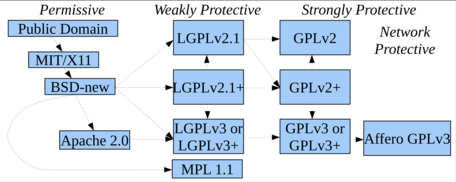

layout: true

.header[
.font-xs.bold.nord8.letter-spacing-60[Free & Open-source software licenses]
]

.footnote[
.font-sm.bold.nord8[sebastien.campion@pm.me
.ri-creative-commons-line.icon-inline.nord8[]
.ri-creative-commons-by-line.icon-inline.nord8[]
.ri-creative-commons-nc-line.icon-inline.nord8[]
.ri-creative-commons-sa-line.icon-inline.nord8[]
]]

---
class: nord-dark, center, middle

background-image: url(img/riccardo-annandale-7e2pe9wjL9M-unsplash3.jpg)

 
 
 

# [IP and Software Code Management  ](https://github.com/scampion/IP-and-Software-Code-Management/archive/main.zip)
 

####  

 

 
 
 
 

.float-right.width-0.pt-xxs.pl-xs[]

.letter-spacing-100[DRAFT VERSION]

---
# What's the OSS compliance ? 
-----------------------------

.center[“Open source compliance is the process by which users, integrators and developers of open source software observe copyright notices and satisfy license obligations for their open source software components”]
.right[The Linux Foundation]

-------

.float-right.width-45.pt-xxs.pl-xs[]

Reminder : [Free & Open-source software licenses previous webinar](https://scampion.github.io/Free-and-Open-source-software-licenses/)

---
# Why now ?
------------ 
.block-middle.width-90[]
.right.font-sm.nord9[Source: [Open Source Licensing: Types, Strategies and Compliance - Jeff Luszcz](https://www.youtube.com/watch?v=GGabCyCbTVU)]
---
.block-middle.width-90[]
.right.font-sm.nord9[Source: Quo Vadis, Open Source? The Limits of Open Source Growth]
---
.block-middle.width-90[]
.right.font-sm.nord9[Source: Quo Vadis, Open Source? The Limits of Open Source Growth]
---
#The Rise of open source software
--------------------------------- 

.block-middle.width-90[]

---

class: nord-dark, center, middle
background-image: url(img/markus-winkler-9XfSFjcwGh0-unsplash2.jpg)

.center.font-xxl["Many companies don't have any open source compliance processes in place and this goes from smaller companies to large big groups"]

.right.font-l[[Hendrik Schoettle, Osborne Clarke](https://www.youtube.com/watch?v=foD0xJOtT54)]

---
# Press Coverage 
.block-middle.width-90[]
.right.font-sm.nord9[Source: [The rise of copyright trolls](https://lwn.net/Articles/721458/)]

---

# Why OSS Compliance matters ? 
---------------------------------

## ∙ Claim money for non-compliance
An attack simply by claiming money due to non-compliance is something you do not want to have on your desk because you will you have to ensure and achieve compliance but in a very short time frame     
[Copyright Trolling: Abusive Litigation Based on a GPL Compliance](https://ipkitten.blogspot.com/2019/02/copyright-trolling-abusive-litigation.html)

## ∙ Breach of contracts 

if you do not provide sufficient information on open source licenses contained in your software this may be considered a contractual breach

## ∙ Mergers and Acquisitions 
Essential for the purchaser to know to what extent is open source software contained in that company. 

Some cases this led to a massive price decrease due to a larger ip issues or non-compliance

.center[*License obligations are easily infringed as many licenses do require a number of obligations*]

---

#What 
Free and Open Source Compliance 
.block-middle.width-90[]
.right.font-sm.nord9[Source: [The rise of copyright trolls](https://lwn.net/Articles/721458/)]
---

