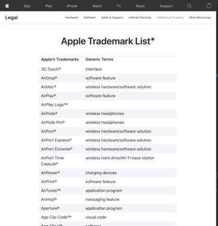
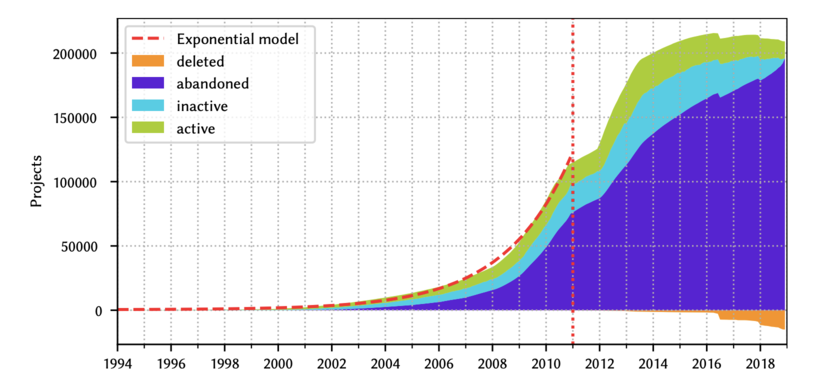

layout: true
.header[
.font-xs.bold.nord8.letter-spacing-60[IP and Software Code Management]
]
.footnote[
.font-sm.bold.nord8[sebastien.campion@pm.me
.ri-creative-commons-line.icon-inline.nord8[]
.ri-creative-commons-by-line.icon-inline.nord8[]
.ri-creative-commons-nc-line.icon-inline.nord8[]
.ri-creative-commons-sa-line.icon-inline.nord8[]
]]
---
class: nord-dark, center, middle
background-image: url(img/riccardo-annandale-7e2pe9wjL9M-unsplash3.jpg)
   
# [IP and Software Code Management](https://github.com/scampion/IP-and-Software-Code-Management/archive/main.zip)
 
####  
     
.float-right.width-0.pt-xxs.pl-xs[]
.letter-spacing-100[DRAFT VERSION]
---

class: nord-dark
background-image: url(img/melinda-gimpel-xcVW_sFp4jQ-unsplash.jpg)
## Disclaimer
_______________
# I'M NOT A 
---

# Types of software
_______________________
## from scratch 
### multinational corporations like Apple or Google can do that kind of software
[Supreme Court Hears Copyright Battle Between Google and Oracle](https://www.nytimes.com/2020/10/07/us/supreme-court-google-oracle.html)
 
 

## coupled to available source code  
#### small and medium businesses
####  ∙ linked to free and/or open source libraries
##### > in that case, you must deploy an OSS Compliance process  
#### ∙ linked to a proprietary 
##### > idem, you must clarify what legal rights you have over the purchased programming code.  

---

# ⚙️ Best practises
________________

### - Use a version control system like Git 

#####  ∙ Deploy forge like [Gitlab](https://about.gitlab.com/) or [Gitea](https://gitea.io/) 
##### ∙ Make it use mandatory
##### ∙ Source code traceability `git blame` to discover who is coding what 
### - [Sign your Work](https://git-scm.com/book/en/v2/Git-Tools-Signing-Your-Work) use GPG when you commit 
### - Prohibit third parties copy/paste as much as possible
##### Use language packaging system like Maven for Java, pip for python etc ... 
##### ... otherwise but it in a dedicated folder `third-libs` and check that a license exist 

 

---

# Four types of IP rights relevant to software
_________________________________________
## ∙ patents
## ∙ copyrights
## ∙ trade secrets
## ∙ trademarks 
---

# Trademarks
____________
.float-right.width-45.pt-xxs.pl-xs[]

### ∙ Do not protect technology, but the names or symbols used to distinguish a product
### ∙ Derivatives works can protected
##### Images, vectors graphics, graphical interface or fonts

 
Debian and Mozilla - a study in trademarks - https://lwn.net/Articles/118268/
.block-middle.width-30[]
---

## Protect your software 
-------------------------
### ∙ runtime packer
- software compresses files and then unpacks itself when a program or file is ready to be executed
- widely used by malwares difficult to deploy 

---

class: center, middle
background-image: url(img/mars2.jpg)
.font-xxl.bold.nord1["... open source release has already provided numerous benefits to NASA, the full benefits of open source can only be realized if NASA is able to establish the processes, policies, and culture needed to encourage and support open source development."]
.right.font-xxl.nord1[[NASA](https://www.nasa.gov/open/source/)]
    
.right.font-l.nord5[[Linux Is Now on Mars, Thanks to NASA's Perseverance Rover](https://www.pcmag.com/news/linux-is-now-on-mars-thanks-to-nasas-perseverance-rover)]
---

# What's the OSS compliance ? 
-----------------------------
.center[“Open source compliance is the process by which users, integrators and developers of open source software observe copyright notices and satisfy license obligations for their open source software components”]
.right[The Linux Foundation]

-------

.float-right.width-45.pt-xxs.pl-xs[]

Reminder : [Free & Open-source software licenses previous webinar](https://scampion.github.io/Free-and-Open-source-software-licenses/)

---
# Why now ?
------------ 
.block-middle.width-90[]
.right.font-sm.nord9[Source: [Open Source Licensing: Types, Strategies and Compliance - Jeff Luszcz](https://www.youtube.com/watch?v=GGabCyCbTVU)]
---
.block-middle.width-90[]
.right.font-sm.nord9[Source: Quo Vadis, Open Source? The Limits of Open Source Growth]
---
.block-middle.width-90[]
.right.font-sm.nord9[Source: Quo Vadis, Open Source? The Limits of Open Source Growth]
---
#The Rise of open source software
--------------------------------- 

.block-middle.width-90[]

---
#Where it can be apply ? 
------------------------

Mainly when you distribute you product ... 

.float-right.width-47.pt-xxs.pl-xs[]

---
class: nord-dark, center, middle
background-image: url(img/markus-winkler-9XfSFjcwGh0-unsplash2.jpg)

.center.font-xxl["Many companies don't have any open source compliance processes in place and this goes from smaller companies to large big groups"]

.right.font-l[[Hendrik Schoettle, Osborne Clarke](https://www.youtube.com/watch?v=foD0xJOtT54)]

---
# 📰 Press Coverage 
--------------------
.block-middle.width-90[]
.right.font-sm.nord9[Source: [The rise of copyright trolls](https://lwn.net/Articles/721458/)]

---

# Why OSS Compliance matters ? 
---------------------------------

## ∙ Claim money for non-compliance
An attack simply by claiming money due to non-compliance is something you do not want to have on your desk because you will you have to ensure and achieve compliance but in a very short time frame     
[Copyright Trolling: Abusive Litigation Based on a GPL Compliance](https://ipkitten.blogspot.com/2019/02/copyright-trolling-abusive-litigation.html)

## ∙ Breach of contracts 

if you do not provide sufficient information on open source licenses contained in your software this may be considered a contractual breach

## ∙ Mergers and Acquisitions 
Essential for the purchaser to know to what extent is open source software contained in that company. 

Some cases this led to a massive price decrease due to a larger ip issues or non-compliance

.center[*License obligations are easily infringed as many licenses do require a number of obligations*]

---

# What❓ 
Free and Open Source Compliance 
.block-middle.width-90[]
.right.font-sm.nord9[Source: [The rise of copyright trolls](https://lwn.net/Articles/721458/)]

---
# 📜 Open source policy 
-----------------------------------
#### ∙ Define your policy governing the open source license compliance:
###### - of the Supplied Software (Open source and others) 
###### - for contributions to open source projects

#### ∙ Apply your policy !!!

---

# 🧾 Software Bill Of Materials SBOM 
__________________________________

#### ∙ Create and maintain an inventory of your dependencies 
#### ∙ In a paranoid mode, do it recursively ... 
   
   
[Cyber Supply Chain Management and Transparency Act of 2014](https://www.congress.gov/bill/113th-congress/house-bill/5793)
require government agencies to obtain SBOMs for any new products they purchase, for
 "any software, firmware, or product in use by the United States Government".

.block-middle.width-40[]

Source: [National Telecommunications and Information Administration](https://www.ntia.doc.gov/files/ntia/publications/ntia_sbom_energy_jan2021overview_0.pdf)

Source: [Why We Need a Software Bill of Materials Industry Standard](https://devops.com/why-we-need-a-software-bill-of-materials-industry-standard/)

A lack of standardization ...

---
# 🏁 How to monitor your OSS Compliance ? 
-----------------------------------------
## Define your OSS policy 
## Staffing 
## Process 

---
# 🛠 Tools, standard and solutions 
----------------------------------
A maze that reflects the maturity of this topic

## ∙ Community
### - [OSS Review Toolkit](oss-review-toolkit.org/)
### - [clearlydefined](https://clearlydefined.io)
### - [Fossology](https://www.fossology.org/)
### - [TERN](https://github.com/tern-tools/tern) for docker images
## ∙ Vendors
### - [Black Duck](https://www.blackducksoftware.com/)
### - [White Source](https://www.whitesourcesoftware.com/)
### - [Dependency Track](https://dependencytrack.org/)
## ∙ Others
### - [REUSE](https://reuse.software/)
### - [Software Heritage](https://www.softwareheritage.org)
### - [Eclipse SW360](https://www.eclipse.org/sw360/)
### - [Open Chain](https://www.openchainproject.org/)
-     Self-Certify Your Organization
-     Independent Assessment? Third-Party Certification?

---

### 🔬 Software Heritage Confidential Scanner
----------------------------------------------
https://scan.certcode.eu
<iframe width="100%" height="500" src="https://scan.certcode.eu" allowfullscreen frameborder=”no” border=”0″ marginwidth=”0″ marginheight=”0″ scrolling=”no” allowtransparency=”yes”></iframe>

---

# Best practices : Compliance in your CI / CD pipeline
-------------------------------------------------------

Build and verify often as possible, as soon as possible.

Discovered a compliance issue at the end of the development process is more embarrassing than during the development itself

#### "compliance-build" script 
#### Use docker container or VMs to encapsulate the build environment

---
## 🧾 Recommendations
---------------------

### Communicate with the upstream suppliers in advance
### Get your suppliers involved with OpenChain
### Ideas: 
#### Put penalties for failure to disclose open source software in procurement agreements with suppliers
#### Or, require permission in advance to deliver components with OSS

### License manifest (should ask your supplier to provides a manifest for ALL the file in the device)
### Don't do license tracking and source publication as an afterthought 

https://openchain-project.github.io/conformance-questionnaire/questionnaire.pdf
---

## ⛓ OpenChain Self Certification
-----------------------------------
<iframe width="100%" height="500" src="https://openchain-project.github.io/conformance-questionnaire/questionnaire.pdf" allowfullscreen frameborder=”no” border=”0″ marginwidth=”0″ marginheight=”0″ scrolling=”no” allowtransparency=”yes”></iframe>
---

## 🔗 Useful links

------------------
### https://compliance.linuxfoundation.org/
### https://compliance.linuxfoundation.org/developers/process/
### [Book : OPEN SOURCE COMPLIANCE IN THE ENTERPRISE ](https://www.linuxfoundation.org/wp-content/uploads/OpenSourceComplianceHandbook_2018_2ndEdition_DigitalEdition.pdf)

