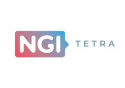
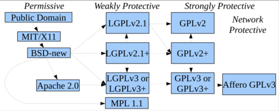
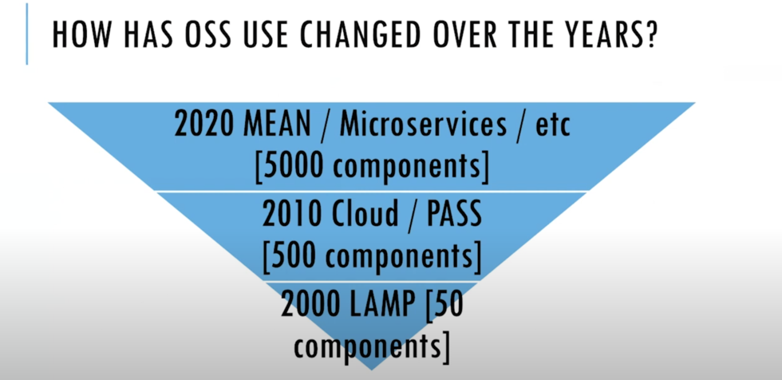
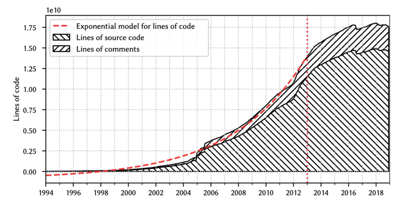
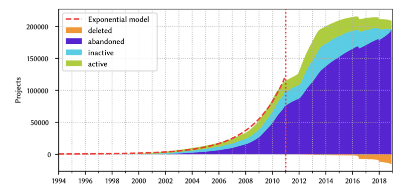
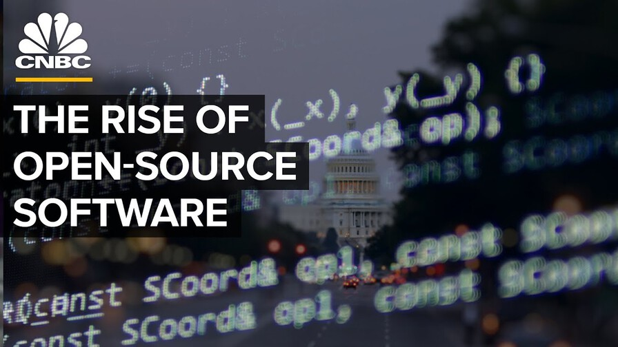
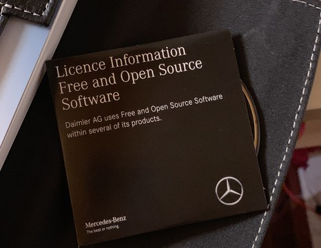
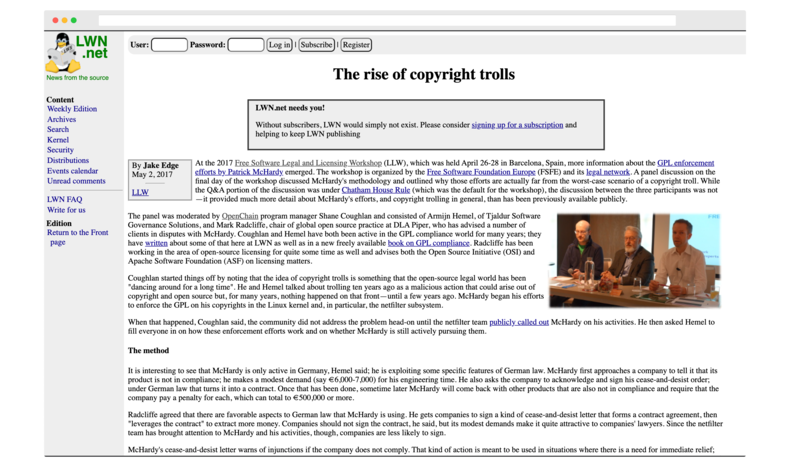

layout: true

.header[
.font-xs.bold.nord8.letter-spacing-60[Free & Open-source software licenses]
]

.footnote[
.font-sm.bold.nord8[sebastien.campion@pm.me
.ri-creative-commons-line.icon-inline.nord8[]
.ri-creative-commons-by-line.icon-inline.nord8[]
.ri-creative-commons-nc-line.icon-inline.nord8[]
.ri-creative-commons-sa-line.icon-inline.nord8[]
]]

---
class: nord-dark, center, middle

background-image: url(img/riccardo-annandale-7e2pe9wjL9M-unsplash3.jpg)

 
 
 

# [IP and Software Code Management  ](https://github.com/scampion/IP-and-Software-Code-Management/archive/main.zip)
 

####  

 

 
 
 
 

.float-right.width-0.pt-xxs.pl-xs[]

.letter-spacing-100[DRAFT VERSION]

---
# What's the OSS compliance ? 
-----------------------------

.center[“Open source compliance is the process by which users, integrators and developers of open source software observe copyright notices and satisfy license obligations for their open source software components”]
.right[The Linux Foundation]

-------

.float-right.width-45.pt-xxs.pl-xs[]

Reminder : [Free & Open-source software licenses previous webinar](https://scampion.github.io/Free-and-Open-source-software-licenses/)

---
# Why now ?
------------ 
.block-middle.width-90[]
.right.font-sm.nord9[Source: [Open Source Licensing: Types, Strategies and Compliance - Jeff Luszcz](https://www.youtube.com/watch?v=GGabCyCbTVU)]
---
.block-middle.width-90[]
.right.font-sm.nord9[Source: Quo Vadis, Open Source? The Limits of Open Source Growth]
---
.block-middle.width-90[]
.right.font-sm.nord9[Source: Quo Vadis, Open Source? The Limits of Open Source Growth]
---
#The Rise of open source software
--------------------------------- 

.block-middle.width-90[]

---
#Where it can be apply ? 
------------------------

Mainly when you distribute you product ... 

.float-right.width-47.pt-xxs.pl-xs[]

---
class: nord-dark, center, middle
background-image: url(img/markus-winkler-9XfSFjcwGh0-unsplash2.jpg)

.center.font-xxl["Many companies don't have any open source compliance processes in place and this goes from smaller companies to large big groups"]

.right.font-l[[Hendrik Schoettle, Osborne Clarke](https://www.youtube.com/watch?v=foD0xJOtT54)]

---
# Press Coverage 
.block-middle.width-90[]
.right.font-sm.nord9[Source: [The rise of copyright trolls](https://lwn.net/Articles/721458/)]

---

# Why OSS Compliance matters ? 
---------------------------------

## ∙ Claim money for non-compliance
An attack simply by claiming money due to non-compliance is something you do not want to have on your desk because you will you have to ensure and achieve compliance but in a very short time frame     
[Copyright Trolling: Abusive Litigation Based on a GPL Compliance](https://ipkitten.blogspot.com/2019/02/copyright-trolling-abusive-litigation.html)

## ∙ Breach of contracts 

if you do not provide sufficient information on open source licenses contained in your software this may be considered a contractual breach

## ∙ Mergers and Acquisitions 
Essential for the purchaser to know to what extent is open source software contained in that company. 

Some cases this led to a massive price decrease due to a larger ip issues or non-compliance

.center[*License obligations are easily infringed as many licenses do require a number of obligations*]

---

#What 
Free and Open Source Compliance 
.block-middle.width-90[]
.right.font-sm.nord9[Source: [The rise of copyright trolls](https://lwn.net/Articles/721458/)]
---

---

# 🏁 How to monitor your OSS Compliance ? 

## Define your OSS policy 
## Staffing 
## Process 

---

# 🛠 Tools, standard and solutions 

## ∙ Community
### - [OSS Review Toolkit](oss-review-toolkit.org/)
### - [clearlydefined](https://clearlydefined.io)
### - [Fossology](https://www.fossology.org/)
### - [TERN](https://github.com/tern-tools/tern) for docker images
## ∙ Vendors
### - [Black Duck](https://www.blackducksoftware.com/)
### - [White Source](https://www.whitesourcesoftware.com/)
### - [Dependency Track](https://dependencytrack.org/)
## ∙ Others
### - [REUSE](https://reuse.software/)
### - [Software Heritage](https://www.softwareheritage.org)
### - [Eclipse SW360](https://www.eclipse.org/sw360/)
### - [Open Chain](https://www.openchainproject.org/)
-     Self-Certify Your Organization
-     Independent Assessment? Third-Party Certification?

---

### 🔬 Software Heritage Confidential Scanner
----------------------------------------------
https://scan.certcode.eu
<iframe width="100%" height="500" src="https://scan.certcode.eu" allowfullscreen frameborder=”no” border=”0″ marginwidth=”0″ marginheight=”0″ scrolling=”no” allowtransparency=”yes”></iframe>

---

## Recommandations

### Communicate with the upstream suppliers in advance
### Get your suppliers involved with OpenChain
### Ideas: 
#### Put penalties for failure to disclose open source software in procurement agreements with suppliers
#### Or, require permission in advance to deliver components with OSS

### License manifest (should ask your supplier to provides a manifest for ALL the file in the device)
### Don't do license tracking and source publication as an afterthought 

### Build and verify
#### "compliance-build" script 
#### Use docker container or VMs to encapsulate the build environment

---

## 🔗 Useful links

### https://compliance.linuxfoundation.org/
### https://compliance.linuxfoundation.org/developers/process/
### [Book : OPEN SOURCE COMPLIANCE IN THE ENTERPRISE ](https://www.linuxfoundation.org/wp-content/uploads/OpenSourceComplianceHandbook_2018_2ndEdition_DigitalEdition.pdf)

##### 🔗 Webography
--------------------
.font-xs.nord9[
Quo Vadis, Open Source? The Limits of Open Source Growth https://arxiv.org/abs/2008.07753
Free Software Foundation Europe https://fsfe.org/
The rise of copyright trolls https://lwn.net/Articles/721458/ 

]

---

##### 📢 Disclaimer
--------------------
> The information contained in this presentation shall not be considered as the official position of the European Commission and/or the TETRA Consortium partners. Neither the TETRA Consortium partners, nor the European Commission, nor any person acting on behalf of the European Commission or the TETRA Consortium is responsible for the use, which might be made of this presentation.
 
  

##### 📷 Credits 
--------------
.font-xs.nord9[
- ◦ Photo by <a href="https://unsplash.com/@melindagimpel?utm_source=unsplash&amp;utm_medium=referral&amp;utm_content=creditCopyText">Melinda Gimpel</a> on <a href="https://unsplash.com/?utm_source=unsplash&amp;utm_medium=referral&amp;utm_content=creditCopyText">Unsplash</a>
- ◦ Photo by <a href="https://unsplash.com/@pavement_special?utm_source=unsplash&amp;utm_medium=referral&amp;utm_content=creditCopyText">Riccardo Annandale</a> on <a href="https://unsplash.com/?utm_source=unsplash&amp;utm_medium=referral&amp;utm_content=creditCopyText">Unsplash</a>
- ◦ Photo by <a href="https://unsplash.com/@kslupski?utm_source=unsplash&amp;utm_medium=referral&amp;utm_content=creditCopyText">Chris Slupski</a> on <a href="https://unsplash.com/?utm_source=unsplash&amp;utm_medium=referral&amp;utm_content=creditCopyText">Unsplash</a>
- ◦ Photo by <a href="https://unsplash.com/@jeshoots?utm_source=unsplash&amp;utm_medium=referral&amp;utm_content=creditCopyText">JESHOOTS.COM</a> on <a href="https://unsplash.com/s/photos/agenda?utm_source=unsplash&amp;utm_medium=referral&amp;utm_content=creditCopyText">Unsplash</a>
- ◦ Photo by <a href="https://unsplash.com/@umby?utm_source=unsplash&amp;utm_medium=referral&amp;utm_content=creditCopyText">Umberto</a> on <a href="https://unsplash.com/?utm_source=unsplash&amp;utm_medium=referral&amp;utm_content=creditCopyText">Unsplash</a>
- ◦ Photo by <a href="https://unsplash.com/@isaacmsmith?utm_source=unsplash&amp;utm_medium=referral&amp;utm_content=creditCopyText">Isaac Smith</a> on <a href="https://unsplash.com/s/photos/growth-graph?utm_source=unsplash&amp;utm_medium=referral&amp;utm_content=creditCopyText">Unsplash</a>
]

---
