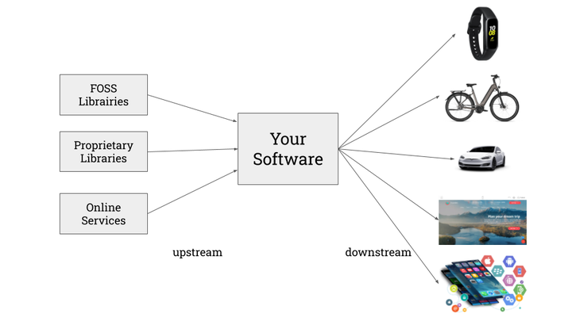
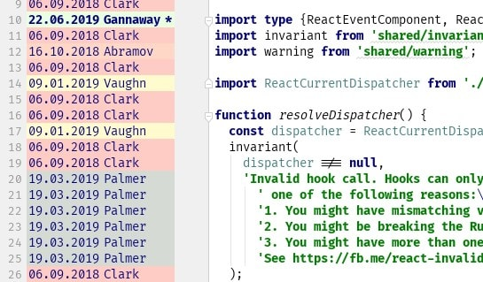
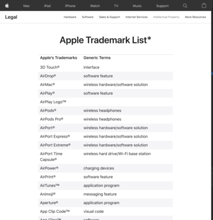
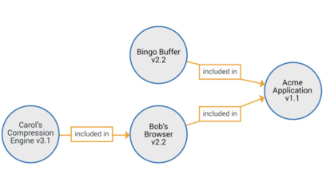

layout: true
.header[
.font-xs.bold.nord8.letter-spacing-60[IP and Software Code Management]
]
.footnote[
.font-sm.bold.nord8[sebastien.campion@pm.me
.ri-creative-commons-line.icon-inline.nord8[]
.ri-creative-commons-by-line.icon-inline.nord8[]
.ri-creative-commons-nc-line.icon-inline.nord8[]
.ri-creative-commons-sa-line.icon-inline.nord8[]
]]
---
class: nord-dark, center, middle
background-image: url(img/riccardo-annandale-7e2pe9wjL9M-unsplash3.jpg)
   
# [IP and Software Code Management](https://github.com/scampion/IP-and-Software-Code-Management/archive/main.zip)
 
####  
     
.float-right.width-0.pt-xxs.pl-xs[]
.letter-spacing-100[DRAFT VERSION]
---

class: nord-dark
background-image: url(img/melinda-gimpel-xcVW_sFp4jQ-unsplash.jpg)
## Disclaimer
_______________
# I'M NOT A 

---

# 🆎 Types of software
_______________________
## from scratch 📝
### multinational corporations like Apple or Google can do that kind of software
[Supreme Court Hears Copyright Battle Between Google and Oracle](https://www.nytimes.com/2020/10/07/us/supreme-court-google-oracle.html)
 
 

## coupled to available source code ↔️ 
#### small and medium businesses
####  ∙ linked to free and/or open source libraries
##### > in that case, you must deploy an OSS Compliance process  
#### ∙ linked to a proprietary 
##### > idem, you must clarify what legal rights you have over the purchased programming code.  

---

# 🗺 Plan 
__________

## 1. Downstream : IP rights relevant to software
## 2. Upstream: Focus on OSS Compliance 

.center[]

---

class: nord-dark, center, middle

## A fundamental prerequisite
## manage your source code
 
### Objective: easily identify the origin of each line of your software
---

# ⚙️ Your code source history
_____________________________

### - Use a version control system like GIT  
##### ∙ Deploy forge like [Gitlab](https://about.gitlab.com/) or [Gitea](https://gitea.io/) 
##### ∙ Make it use mandatory
.float-right.width-52.pt-xxs.pl-xs[]

##### ∙ Use `git blame` to discover who is coding what and why (commit message)
### - [Sign your Work](https://git-scm.com/book/en/v2/Git-Tools-Signing-Your-Work), use GPG when you commit 
### - Prohibit third parties copy/paste as much as possible
##### Use language packaging system like Maven for Java, pip for python etc ... 
##### ... if not possible, place it in a dedicated folder `third-libs` and check license presence 

---

# [Gource](https://gource.io/) example 
________________

.center[<iframe width="860" height="515" src="https://www.youtube-nocookie.com/embed/GTMC3g2Xy8c?rel=0" frameborder="0" allow="accelerometer; autoplay; clipboard-write; encrypted-media; gyroscope; picture-in-picture" allowfullscreen></iframe> ]
---

# Four types of IP rights relevant to software
_________________________________________
## ∙ trademarks 
## ∙ patents
## ∙ trade secrets
## ∙ copyrights
---

# Trademarks ®™  
____________
.float-right.width-45.pt-xxs.pl-xs[]

### ∙ Do not protect technology, but the names or symbols used to distinguish a product
### ∙ Derivatives works can protected
##### Images, vectors graphics, graphical interface or fonts

 
Debian and Mozilla - a study in trademarks - https://lwn.net/Articles/118268/
.block-middle.width-30[]
---

# Patents  📜 
______________

.center.font-xxl["The law relating to the patentability of software is still not harmonized internationally"]

------
    In EU software patents doesn't exists but ... patent could be use to protect your idea.
    In that case, if your technical approach is new, you can decide to create a patent which will describe in terms of 
    input/output and process how to solve an issue.
Duplicate a software in another language is possible. If it use a patented technic, it's less true. 

Be aware, it works in both side, your idea may be already patented, a prior art search is always useful.

- - [EspaceNet](https://worldwide.espacenet.com/)
- - [PATENTSCOPE](https://www.wipo.int/patentscope/)
- - [Google patents](https://patents.google.com/)
- - [Patent Lens](https://www.lens.org/) 

... limited in time 

---

# Trade secrets 🕵️
------------------

### Hard to implement for sofware
#### - Reverse engineering is a well widespread practise 🔄
 

### ☁️ Online service exception
#### - ⚠️ Beware of [Cloud act](https://en.wikipedia.org/wiki/CLOUD_Act)
 

### If you need to protect your software  
### ∙ use code obfuscation techniques 
### ∙ use runtime packer 📦
- This software compresses files and then unpacks itself when a program or file is ready to be executed
- widely used by malwares difficult to deploy 

---

# Copyrights © 
_____________
Copyright law and patent law provide different types of protection.
    
    Copyright protection extends only to expressions, and not to ideas, procedures, methods of
    operation or mathematical concepts as such, whereas a patent is an exclusive right granted for an invention, 
    which is a product or a process that provides a new way of doing something, or offers a new technical
    solution to a problem.
.right[[WIPO](https://www.wipo.int/copyright/en/activities/software.html)]
    
    To enjoy copyright protection, no registration or other formality concerning software is required.
    Copyright protection is granted from the sole fact of the creation of the computer program.
.right[[European IP Helpdesk](https://www.iprhelpdesk.eu/news/copyright-or-patent-how-protect-my-software)]
    
##### - prevent the unauthorized copying
##### - Allow you to define your [End-user license agreement](https://en.wikipedia.org/wiki/End-user_license_agreement)
##### - Copyleft &copy;  : "... redistributing the work [...] on condition that recipients are also granted these rights." 🦠

---
class: center, middle 
                                             
# Upstream and compliance                                                                
__________________________                                             
                                                                       
.center[]                                        
                                                                                                                                                                                                               
---

class: center, middle
background-image: url(img/mars2.jpg)
.font-xxl.bold.nord1["... open source release has already provided numerous benefits to NASA, the full benefits of open source can only be realized if NASA is able to establish the processes, policies, and culture needed to encourage and support open source development."]
.right.font-xxl.nord1[[NASA](https://www.nasa.gov/open/source/)]
    
.right.font-l.nord5[[Linux Is Now on Mars, Thanks to NASA's Perseverance Rover](https://www.pcmag.com/news/linux-is-now-on-mars-thanks-to-nasas-perseverance-rover)]
---

# What's the OSS compliance ? 
-----------------------------
.center[“Open source compliance is the process by which users, integrators and developers of open source software observe copyright notices and satisfy license obligations for their open source software components”]
.right[The Linux Foundation]

-------

.float-right.width-45.pt-xxs.pl-xs[]

Reminder : [Free & Open-source software licenses previous webinar](https://scampion.github.io/Free-and-Open-source-software-licenses/)

---

# Why now ?
___________
 
.block-middle.width-90[]
.right.font-sm.nord9[Source: [Open Source Licensing: Types, Strategies and Compliance - Jeff Luszcz](https://www.youtube.com/watch?v=GGabCyCbTVU)]
---
class: middle,center

.right.font-sm.nord9[Source: Quo Vadis, Open Source? The Limits of Open Source Growth]
---
class: middle,center

.block-middle.width-90[]
.right.font-sm.nord9[Source: Quo Vadis, Open Source? The Limits of Open Source Growth]
---

#The Rise of open source software
--------------------------------- 

.block-middle.width-90[]

---

# Where it can be apply ? 
------------------------

.float-right.width-47.pt-xxs.pl-xs[]
## when you distribute your product 🛍 ... 
## ☁️ ︎but online services are also concerned (see the [AGPL](https://www.gnu.org/licenses/agpl-3.0.en.html))  

---
class: nord-dark, center, middle
background-image: url(img/markus-winkler-9XfSFjcwGh0-unsplash2.jpg)

.center.font-xxl["Many companies don't have any open source compliance processes in place and this goes from smaller companies to large big groups"]

.right.font-l[[Hendrik Schoettle, Osborne Clarke](https://www.youtube.com/watch?v=foD0xJOtT54)]

---

# 📰 Press Coverage 
--------------------
.block-middle.width-90[]
.right.font-sm.nord9[Source: [The rise of copyright trolls](https://lwn.net/Articles/721458/)]

---

# Why OSS Compliance matters ? 
---------------------------------

## ∙ Claim money for non-compliance
An attack simply by claiming money due to non-compliance is something you do not want to have on your desk because you will you have to ensure and achieve compliance but in a very short time frame     
[Copyright Trolling: Abusive Litigation Based on a GPL Compliance](https://ipkitten.blogspot.com/2019/02/copyright-trolling-abusive-litigation.html)

## ∙ Breach of contracts 

if you do not provide sufficient information on open source licenses contained in your software this may be considered a contractual breach

## ∙ Mergers and Acquisitions 
Essential for the purchaser to know to what extent is open source software contained in that company. 

Some cases this led to a massive price decrease due to a larger ip issues or non-compliance

.center[*License obligations are easily infringed as many licenses do require a number of obligations*]

---

# 📜 Open source policy 
------------------------
##Define your policy governing the open source license compliance:
### - of the Supplied Software (Open source and others) 
### - for contributions to open source projects
 
 
###.center[☑️ Apply your policy !!!]

---

# 🧾 Software Bill Of Materials SBOM 
____________________________________

#### ∙ Create and maintain an inventory of your dependencies 
#### ∙ In a paranoid mode, do it recursively ... 
      
[Cyber Supply Chain Management and Transparency Act of 2014](https://www.congress.gov/bill/113th-congress/house-bill/5793)
require government agencies to obtain SBOMs for any new products they purchase, for
 "any software, firmware, or product in use by the United States Government".

.block-middle.width-40[]

Source: [National Telecommunications and Information Administration](https://www.ntia.doc.gov/files/ntia/publications/ntia_sbom_energy_jan2021overview_0.pdf)

Source: [Why We Need a Software Bill of Materials Industry Standard](https://devops.com/why-we-need-a-software-bill-of-materials-industry-standard/)

A lack of standardization ... but

---

# Two formats/standards to implement SBOM 
__________________________________________

### *[SPDX](https://spdx.org/)* is an open standard for communicating software bill of material information (including components, licenses, copyrights, and security references). 
The SPDX specification is developed by the SPDX workgroup, which is hosted by The Linux Foundation.

The grassroots effort includes representatives from more than 20 organizations—software, systems and tool vendors, foundations and systems integrators.

### *[CycloneDX](https://cyclonedx.org/)* purpose-built for software security contexts and supply chain component analysis. 

The specification is maintained by the CycloneDX Core working group, with origins in the [OWASP](https://owasp.org/) community

---

# 🏁 How to monitor your OSS Compliance ? 
-----------------------------------------
## 1. Define your OSS policy 
## 2. Staffing 
## 3. Process 

---

## ⛓ [OpenChain Self Certification](https://openchain-project.github.io/conformance-questionnaire/questionnaire.pdf)
-----------------------------------
<iframe width="100%" height="500" src="https://openchain-project.github.io/conformance-questionnaire/questionnaire.pdf" allowfullscreen frameborder=”no” border=”0″ marginwidth=”0″ marginheight=”0″ scrolling=”no” allowtransparency=”yes”></iframe>

---

# ☑️ Compliance in your CI / CD pipeline
-----------------------------------------

### 🏗 Build and verify often as possible, as soon as possible.
 
.center["Discovered a compliance issue at the end of the development process]
.center[is more embarrassing than during the development itself"]
 

#### - Setup your "compliance-build" script 
#### - Use docker container or VMs to encapsulate the build environment

---

## 🧾 With others suppliers
-----------------------------

### 1. Communicate with the upstream suppliers in advance
#### Get your suppliers involved with OpenChain
##### Ideas: 
##### Put penalties for failure to disclose open source software in procurement agreements with suppliers
##### Or, require permission in advance to deliver components with OSS

### 2. License manifest (should ask your supplier to provides a manifest for ALL the file in the device)
### 3. Don't do license tracking and source publication as an afterthought 

---

# 🛠 Tooling 
-------------
### ∙ Community
##### - [OSS Review Toolkit](oss-review-toolkit.org/)
##### - [clearlydefined](https://clearlydefined.io)
##### - [Fossology](https://www.fossology.org/)
##### - [TERN](https://github.com/tern-tools/tern) for docker images
### ∙ Vendors
##### - [Black Duck](https://www.blackducksoftware.com/)
##### - [White Source](https://www.whitesourcesoftware.com/)
##### - [Dependency Track](https://dependencytrack.org/)
### ∙ Others
##### - [REUSE](https://reuse.software/)
##### - [CycloneDX](https://cyclonedx.org/tool-center/)
##### - [Software Heritage](https://www.softwareheritage.org)
##### - [Eclipse SW360](https://www.eclipse.org/sw360/)
##### - [Open Chain](https://www.openchainproject.org/) (Self-Certify Your Organization, Independent Assessment? Third-Party Certification)

---

### 🔬 [Software Heritage Confidential Scanner](https://scan.certcode.eu)
----------------------------------------------

<iframe width="100%" height="500" src="https://scan.certcode.eu" allowfullscreen frameborder=”no” border=”0″ marginwidth=”0″ marginheight=”0″ scrolling=”no” allowtransparency=”yes”></iframe>

---

### 📢 Disclaimer
__________________
> The information contained in this presentation shall not be considered as the official position of the European Commission and/or the TETRA Consortium partners. Neither the TETRA Consortium partners, nor the European Commission, nor any person acting on behalf of the European Commission or the TETRA Consortium is responsible for the use, which might be made of this presentation.
 

---

###### 🔗 Useful links & Webography
__________________

.font-xs.nord9[
Quo Vadis, Open Source? The Limits of Open Source Growth https://arxiv.org/abs/2008.07753

Free Software Foundation Europe https://fsfe.org/

The rise of copyright trolls https://lwn.net/Articles/721458/ 

https://compliance.linuxfoundation.org/

https://compliance.linuxfoundation.org/developers/process/

[Book : OPEN SOURCE COMPLIANCE IN THE ENTERPRISE ](https://www.linuxfoundation.org/wp-content/uploads/OpenSourceComplianceHandbook_2018_2ndEdition_DigitalEdition.pdf)

]

 

##### 📷 Credits 
--------------
.font-xs.nord9[
- ◦ Photo by <a href="https://unsplash.com/@melindagimpel?utm_source=unsplash&amp;utm_medium=referral&amp;utm_content=creditCopyText">Melinda Gimpel</a> on <a href="https://unsplash.com/?utm_source=unsplash&amp;utm_medium=referral&amp;utm_content=creditCopyText">Unsplash</a>
- ◦ Photo by <a href="https://unsplash.com/@pavement_special?utm_source=unsplash&amp;utm_medium=referral&amp;utm_content=creditCopyText">Riccardo Annandale</a> on <a href="https://unsplash.com/?utm_source=unsplash&amp;utm_medium=referral&amp;utm_content=creditCopyText">Unsplash</a>
- ◦ Photo by <a href="https://unsplash.com/@kslupski?utm_source=unsplash&amp;utm_medium=referral&amp;utm_content=creditCopyText">Chris Slupski</a> on <a href="https://unsplash.com/?utm_source=unsplash&amp;utm_medium=referral&amp;utm_content=creditCopyText">Unsplash</a>
- ◦ Photo by <a href="https://unsplash.com/@jeshoots?utm_source=unsplash&amp;utm_medium=referral&amp;utm_content=creditCopyText">JESHOOTS.COM</a> on <a href="https://unsplash.com/s/photos/agenda?utm_source=unsplash&amp;utm_medium=referral&amp;utm_content=creditCopyText">Unsplash</a>
- ◦ Photo by <a href="https://unsplash.com/@umby?utm_source=unsplash&amp;utm_medium=referral&amp;utm_content=creditCopyText">Umberto</a> on <a href="https://unsplash.com/?utm_source=unsplash&amp;utm_medium=referral&amp;utm_content=creditCopyText">Unsplash</a>
- ◦ Photo by <a href="https://unsplash.com/@isaacmsmith?utm_source=unsplash&amp;utm_medium=referral&amp;utm_content=creditCopyText">Isaac Smith</a> on <a href="https://unsplash.com/s/photos/growth-graph?utm_source=unsplash&amp;utm_medium=referral&amp;utm_content=creditCopyText">Unsplash</a>
]

---